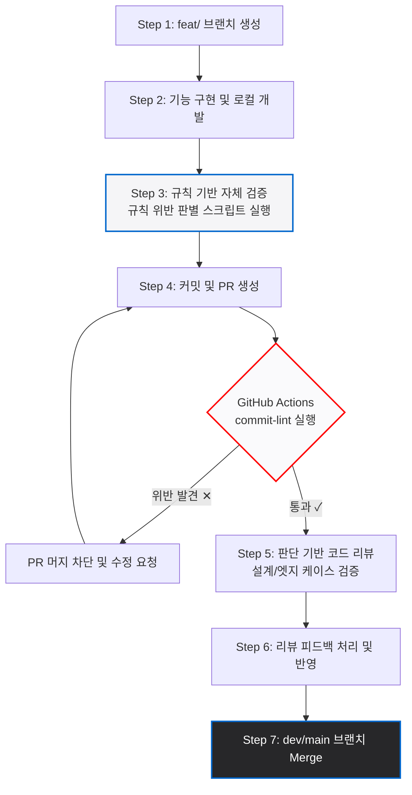
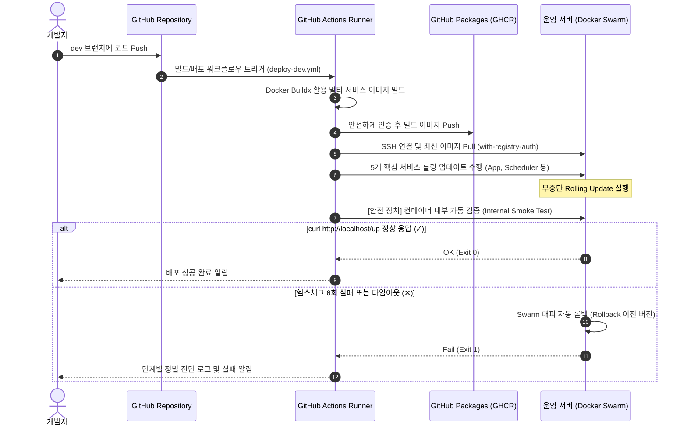

> **"지속 가능한 코드, 견고한 인프라, 자동화를 통한 생산성 극대화"**를 지향합니다.
> 레거시 PHP 환경의 마이그레이션부터 Docker/GitHub Actions 기반의 안정적인 CI/CD 인프라 구축, 그리고 AI(LLM) 환경을 개발 프로세스에 내재화하여 팀의 개발 효율성을 혁신하는 데 집중하고 있습니다.

---

## 🛠️ Tech Stacks

| 분류 | 기술 스택 |
| :--- | :--- |
| **Backend** | PHP 8.3, Laravel 11, Vanilla JS (ES6), RESTful API |
| **DevOps & Infra** | Docker, Docker Swarm, GitHub Actions (Self-hosted Runner), Ubuntu Server 24.04, Shell Script (Bash) |
| **AI & Automation** | Gemini CLI Integration, VS Code Remote Core-Automation, Linux Shared Environments |

---

## 🚀 주요 프로젝트 및 인프라 구축 성과

### 1️⃣ Franchise ERP 시스템 고도화 및 자율형 CI/CD 파이프라인 구축
> **순수 PHP 기반의 레거시 ERP 시스템을 안정적인 Laravel 11 인프라로 전환하고, 배포 프로세스를 100% 자동화했습니다.**

*   **품질 통제 자동화 (`commit-lint.yml`)**
    * 사내 가이드라인(`.claude/docs/commit-convention.md`)과 동기화된 정규표현식 기반 린트(Lint) 파이프라인을 구축하여 규칙 위반 PR의 머지를 자동 차단하는 구조 정립.
    * AI 협업 툴 활용 시 발생하는 무수한 임시 스냅샷 커밋(`auto-snapshot:`)을 식별하여 검증 단계에서 자동 Skip하는 커스텀 예외 처리 구현.
*   **Docker Swarm 무중단 롤링 배포 및 자가 진단 스모크 테스트 (`deploy-dev.yml`)**
    * GitHub Packages(GHCR)에 컨테이너 이미지 빌드/푸시 후, 운영 서버의 5개 핵심 서비스(App, Scheduler, Queue Worker, Reverb, Agent Listener)를 무중단 롤링 업데이트 자동화.
    * 인프라 네트워크 이슈와 분리하여 애플리케이션 정상 기동을 검증하기 위해, **배포 직후 컨테이너 내부에서 루프를 돌며 안정성을 진단하는 내부 Smoke Test 메커니즘 설계** (`set-euo pipefail` 및 `curl` 루프 기반).
    * 업데이트 실패 시 Swarm Rollback 기능과 연동하고 에러 원인별(SSH, GHCR Auth, Swarm, App Up Stream) 정밀 진단 로그가 자동 출력되도록 예외 처리 고도화.
*   **성과 지표 (Metrics)**
    * **리뷰 공수 감소:** 단순 컨벤션 위반 등으로 소모되던 휴먼 피드백 리소스 **60% 이상 절감**.
    * **배포 가속화:** 수동 빌드/반영 프로세스를 완전 자동화하여 배포 소요 시간 단축 (**30분 → 3분 이내, 90% 감소**).

---

### 2️⃣ 전사 협업을 위한 Ubuntu 24.04 공유 개발 환경 및 Shared NVM 인프라 구축
> **다수의 개발자가 동일한 서버 인프라에서 권한 충돌 없이 효율적으로 협업할 수 있는 전용 Linux 공유 환경을 설계했습니다.**

*   **안전한 그룹 기반 권한 정책 수립**
    * 파일 생성 시 동료 개발자가 즉시 수정할 수 있도록 `umask 002` 설정을 전역화하고, `setgid(2775)` 비트를 활용하여 공용 디렉토리 내 생성되는 모든 파일의 소유권이 공유 그룹으로 상속되도록 강제하는 보안 아키텍처 수립.
*   **Shared NVM (Node Version Manager) 환경 구축**
    * 각 계정마다 노드 버전이 꼬이는 현상을 방지하기 위해 `/opt/nvm` 경로에 공유 NVM을 바인딩하고 Node.js v22(LTS) 버전으로 일치시켜 개발 환경 일관성 100% 확보.
*   **성과 지표 (Metrics)**
    * 무분별한 `chmod 777` 남용으로 인한 보안 취약점을 완전히 제거하고, 파일 권한 불일치로 인해 발생하던 **팀 내 협업 블로킹 이슈 0% 달성**.

---

### 3️⃣ AI 기반 "바이브 코딩(Vibe Coding)" 개발 프로세스 및 인프라 내재화
> **AI 보조 도구(Gemini CLI)와 사내 인프라를 결합하여 개발 생산성을 한 단계 더 끌어올렸습니다.**

*   **VS Code Remote - SSH & Gemini CLI 최적화**
    * 원격 우분투 서버 터미널에서 Gemini CLI 실행 시 시스템 지갑(D-Bus) 충돌로 인해 발생하는 터미널 먹통(Hang) 현상을 해결하기 위해 `terminal.integrated.env.linux` 환경 변수 최적화 패턴(`DBUS_SESSION_BUS_ADDRESS="/dev/null"`, `CI="true"`) 고도화.
*   **선행 문서화 작업 및 자동 분석 태스크 등록**
    * VS Code Tasks 설정을 추가하여 드래그한 코드 영역을 단축키 하나로 Gemini API에 전달·분석하는 자동화 기능 구현.
    * 무조건적인 코드 생성 이전에 레거시 파일 분석 문서를 선행 작성하게 만드는 프롬프트 엔지니어링을 결합하여, 마이그레이션 작업 시 비즈니스 로직 오작동률을 대폭 감소시킴.
*   **성과 지표 (Metrics)**
    * 신규 기능 프로토타이핑 및 복잡한 SQL 레거시 쿼리 최적화 소요 시간 **50% 이상 단축**.

---

## 🛠️ 인프라 자동화 핵심 코드 자산

### 🐳 Self-hosted Runner 서비스 자동 영속화
서버가 재부팅되거나 세션이 끊겨도 자동화 빌드 일꾼이 상시 대기할 수 있도록 `systemd` 서비스 레이어에 안전하게 격리 등록하여 운영하고 있습니다.

```bash
# 보안 격리 계정 생성 및 전용 디렉토리 권한 이양
sudo adduser ci-cd
sudo usermod -aG docker ci-cd
sudo mkdir -p /opt/actions-runner && sudo chown ci-cd:ci-cd /opt/actions-runner

# 지속성 수립을 위한 시스템 서비스 영속화
sudo ./svc.sh install ci-cd
sudo ./svc.sh start
```



---

### 2. CI/CD 배포 및 내부 Smoke Test 파이프라인
코드가 push되었을 때 컨테이너 빌드부터 Docker Swarm 무중단 배포, 그리고 안전장치인 내부 스모크 테스트와 자동 롤백이 일어나는 인프라 흐름도입니다[cite: 2].

```markdown




작성중..

## 🙇‍♂️ **Profile**

#### 생일:  ```1993년 11월 27일```
#### 학력:  ```한림대학교 졸업(컴퓨터공학과 4.0/4.5)```
#### 이메일: ```khk37601@gmail.com```
 

## 👨‍💻 Work
| **총 4년**

####  ```Conect(코넥트)```  
2021.01 ~ 재직중   

| 웹 풀스택 개발자
: **소상공인의 e커머스 플랫폼**

성능 개선및 기능 개발을 담당하고있습니다.

####  ```포장대왕(디퓨전랩)```  
2020.03 ~ 2021.01(인턴)   

## ✒ Work

### OAuth 2.0 Authorization server
> Conect & 디퓨전랩
1. 주요내용
   
4. 사용기술
   
      


### Ferp-HQ
### 프렌차이즈 본사 관리 서비스
> Conect & 디퓨전랩
1. 주요내용
   
4. 사용기술
   
       

### Ferp
### 개인사업자용 관리 서비스
> Conect & 디퓨전랩
1. 주요내용
   

4. 사용기술

       


### Order proposal Service
### 주문제안 서비스 개발
> Conect & 디퓨전랩
1. 주요내용
   * 자사 상품 이용하는 고객들의 재고 파익 및 주문제안 서비스  

2. 기여한점
   * Back
     * DB schema, entity, ERD 설계.
     * Rest API 전반 설계.
     * 고객들의 주문데이터 수집및 분석 (기여도: 50%)
     * 재고파악 수식 도출(기여도: 30%)
     * 남은재고, 사용수량, 미래 재고 계산 알고리즘 및 이메일 발송 구현
    
3. 결과/성과
   * 고객 니즈 충족

4. 사용기술

  


### EASYORDER
### 고객 간편주문 서비스 개발
> Conect & 디퓨전랩
1. 주요내용
   * 온라인 주문기능 제공
   * 자주 주문하는 상품과 추천상품 제시 페이지 제공

-------------------------------------------


-------------------------------------------
  
2. 기여한점
   * Front  
      * 로그인, 핸드폰인증, 지점선택, 상품선택, 패스워드 찾기 페이지 구현.
      * Axios API Server 통신.
   * Back
     * DB schema, entity, ERD 설계.
     * Rest API 전반 설계.
     * 타사 관리시스템 주문등록 크롤러 전반 개발.
   * 페이지 개발 전반 진행.

3. 결과/성과
   * 주문 체널을 다향성 증가. 
   * 자주 주문하던 상품만 보이도록 하여 고객의 만족도를 높힘.
   * CS 부서 당담직원 업무 부담 감소.
   
4. 사용기술

      


### Docker Swarm 인프라 구축및 운영
> Conect & 디퓨전랩

#### 상황:
```
1. 초기 자사에는 remote server에 직접 서비스를 실행하는 작업을 시행하고 있었다.
2. 사용량 증가및 여러 서비스를 배포 해야하는 상황 발생.
3. 한정적인 환경에서 효율적으로 운영이 필요.
4. 향후 MSA서비스로 전환하기 위한 사전의 준비 필요.
```

#### 도출:
* ###### 개발자 동료와 소통한 결과 ```k8s(쿠버네티스)```와 ```docker-swarm``` 후보설정
* ###### 소규모에 적합하고 모든 기능이 내장 되어있고 엄청난 장점을 지니고 있는 docker-swarm 이라는 오케스트레이션 툴을 적용하기로 사측에 제안

--------------------------------------


--------------------------------------

#### 역할:
* ###### docker, docker-compose, docker swarm 세팅 및 적용(기여도: 50%)
* ###### synology Private Registry 구축(기여도: 100%)
* ###### 기존의 서비스및 담당 서비스 배포(기여도: 50%)
* ###### proxy-server 구축(기여도 50%)

#### 결과/성과
* ###### 새로운 서비스 배포의 생산성을 높히는데 기여.
* ###### remote server의 ip를 숨겨 보안향상.
* ###### 캐싱을통한 성능향상.
  
#### 사용한 기술
  


#### 그외
[docker란](https://github.com/khk37601/Docker) [docker 적용기](https://github.com/khk37601/tech/blob/main/%EC%9A%B0%EB%8B%B9%ED%83%95%ED%83%95%EA%B0%9C%EB%B0%9C%20%EC%A0%81%EC%9A%A9%EA%B8%B0/docker/docker-swarm.md)


